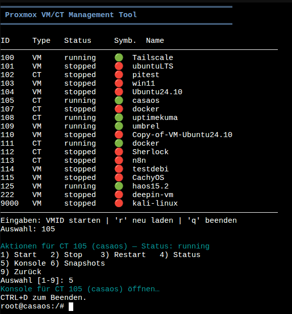

# Proxmox VM/CT Management Tool



A lightweight TUI helper to list & manage Proxmox VMs/containers via `qm`/`pct`.

---

## 🚀 Features

✔ Robust instance listing (supports names with spaces)  
✔ Start / Stop / Restart / Status  
✔ Open console (`pct enter`, `qm terminal` – fallback `qm monitor`)  
✔ Snapshot management (list / create / rollback / delete)  
✔ SPICE info & `.vv` file generation, enable SPICE  
✔ Permission checks, clear TUI interface  
✔ Status icons for quick overview

---

## ⚡ Quick Start (on a Proxmox node)

```bash
apt update && apt install -y git
cd /root && git clone https://github.com/TimInTech/proxmox-manager.git
cd proxmox-manager
chmod +x proxmox-manager.sh install_dependencies.sh
./install_dependencies.sh    # optional helpers (shellcheck, remote-viewer, etc.)
./proxmox-manager.sh
```

---

## 📋 Notes

- **Run as root** on a Proxmox node (requires `qm` and/or `pct` installed)
- **SPICE:** Tool displays `spice://HOST:PORT` and writes `/tmp/vm-<id>.vv` for local viewer use
- **CI:** ShellCheck workflow lints the script on every push/PR
- **Screenshot storage:** For further screenshots, place them in `docs/screenshots/`, filename standard: `proxmox-console-YYYYMMDD-HHMMSS-[context].png`

---

## 🛠️ Function Details

- **Intelligent status extraction:** Detects `running`, `stopped`, `paused`, and error cases.
- **Snapshot management:** List snapshots, create, rollback, and delete directly from the TUI.
- **SPICE integration:** Displays connection info and creates `.vv` viewer files for local use.
- **Console fallback:** If `qm terminal` fails, automatically falls back to `qm monitor`.

---

## 📚 Community

For feedback, feature requests or bug reports please open an issue!  
Pull requests for new features are welcome.

---

## 📝 License

MIT License – see LICENSE

