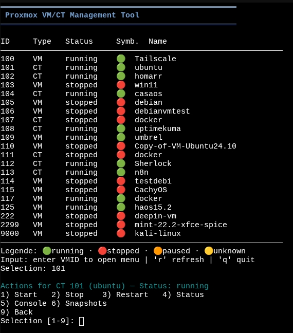

# proxmox-manager

Lightweight terminal UI to list and manage Proxmox VMs/containers directly on the host. Includes status-aware actions, console helpers, snapshot helpers, and JSON output for automation.



## What it does
- Combined VM/CT overview with status symbols
- Start/stop/restart helpers plus console access
- Snapshot and SPICE helpers for VMs
- JSON mode for scripts and monitoring

## Requirements
- Proxmox VE 7.4, 8.x, or 9.x host
- Run on the node as `root` (or set `PROXMOX_MANAGER_ALLOW_NONROOT=1` for testing)
- `qm` and/or `pct` available
- Optional: `remote-viewer` for SPICE, `jq` for JSON tooling

## Install & update
```bash
sudo apt update && sudo apt install -y git
cd /root
git clone --depth=1 https://github.com/TimInTech/proxmox-manager.git
cd proxmox-manager
chmod +x proxmox-manager.sh install_dependencies.sh
./install_dependencies.sh   # optional helpers (jq, remote-viewer, shellcheck)
```

Update later:
```bash
git -C /root/proxmox-manager pull
```

## Run
```bash
./proxmox-manager.sh         # interactive TUI
./proxmox-manager.sh --json  # machine-readable list
```

## CLI options
- `--list` – plain table of all VMs/CTs
- `--json` – JSON array (`id`, `type`, `status`, `symbol`, `name`)
- `--no-clear` – keep screen contents in interactive mode
- `--once` – single refresh; combine with `--json` for scripts
- `--help` – usage

## Development
- Lint: `shellcheck proxmox-manager.sh install_dependencies.sh`
- CI runs shellcheck and gitleaks; reports are artifacts only (not committed)
- For security reports, see `SECURITY.md`; for bugs, open an issue.

## License
[MIT](LICENSE)
