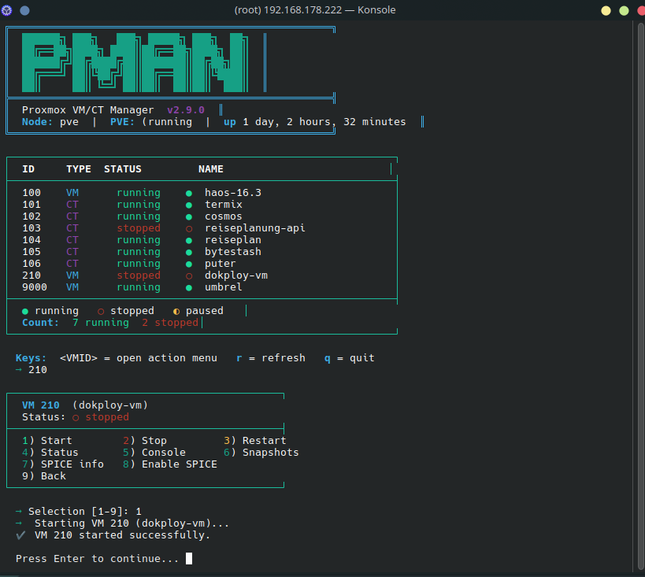
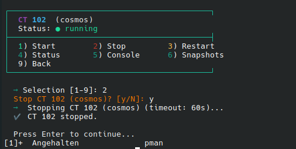

<!-- markdownlint-disable MD033 MD041 -->
<div align="center">

```
╔══════════════════════════════════════════════════════════╗
║  ██████╗ ███╗   ███╗  █████╗  ███╗   ██╗               ║
║  ██╔══██╗████╗ ███║ ██╔══██╗ ████╗  ██║               ║
║  ██████╔╝██╔████╔██║ ███████║ ██╔██╗ ██║               ║
║  ██╔═══╝ ██║╚██╔╝██║ ██╔══██║ ██║╚██╗██║               ║
║  ██║     ██║ ╚═╝ ██║ ██║  ██║ ██║ ╚████║               ║
║  ╚═╝     ╚═╝     ╚═╝ ╚═╝  ╚═╝ ╚═╝  ╚═══╝  v2.9.0      ║
║                                                          ║
║  Proxmox VM/CT Manager · Single Bash · No Dependencies  ║
╚══════════════════════════════════════════════════════════╝
```

**Single-file Bash tool for managing Proxmox VMs and containers.**
No daemons. No agents. No dependencies beyond what ships with Proxmox VE.

[](https://github.com/TimInTech/proxmox-manager/actions)
[](https://github.com/TimInTech/proxmox-manager/actions)
[](LICENSE)
[](https://www.gnu.org/software/bash/)
[](https://www.proxmox.com/)


<a href="https://buymeacoffee.com/timintech" target="_blank" rel="noopener noreferrer"></a>

</div>

---

## 📸 Screenshots

<div align="center">

| Main Menu — VM/CT Table | Action Menu |
|:---:|:---:|
|  |  |
| Live status for all VMs & containers | Per-instance controls: start, stop, console, snapshots |

</div>

---

## 🎯 Features

| | Feature | Details |
|---|---|---|
| 📋 | **List & Status** | All VMs and containers with live status — `[+]` running · `[-]` stopped · `[~]` paused · `[?]` unknown |
| ⚡ | **Start / Stop / Restart** | Confirmation prompt for destructive actions. Proxmox error details on failure. Configurable timeout with force-stop fallback |
| 🖥️ | **Console Access** | LXC shell via `pct enter` or QEMU terminal via `qm terminal`. Verifies running state before entering |
| 📦 | **Snapshot Management** | List, create, rollback, delete — with name validation and snapshot preview before destructive actions |
| 🖱️ | **SPICE Integration** | Enable SPICE for VMs and retrieve `.vv` connection files for remote desktop clients |
| 🤖 | **Automation-Ready** | `--json` output, `--filter` by status, `--force` mode, structured logging via `LOG_FILE` |

---

## 🏗️ How It Works

A single `proxmox-manager.sh` script — no build step, no service, no config files. Runs on-demand as root directly on the Proxmox VE node.

```
  User / Automation
       │
       ▼
  ┌─────────────────────────────────┐
  │  pman  (proxmox-manager.sh)     │
  │                                 │
  │  ┌──────────┐  ┌─────────────┐  │
  │  │ --list   │  │ interactive │  │
  │  │ --json   │  │    TUI      │  │
  │  │ --filter │  │             │  │
  │  └────┬─────┘  └──────┬──────┘  │
  └───────┼───────────────┼─────────┘
          │               │
          ▼               ▼
  ┌───────────────────────────────┐
  │  qm (VMs)  ·  pct (CTs)      │  ← Proxmox CLI (bundled with PVE)
  └───────────────────────────────┘
          │
          ▼
  ┌───────────────────────────────┐
  │  Proxmox VE Host  (local)     │
  │  QEMU Virtual Machines        │
  │  LXC Containers               │
  └───────────────────────────────┘
```

> ✅ No network calls · ✅ No background process · ✅ Bash ≥ 4.0 · ✅ PVE 7.x / 8.x / 9.x

---

## 🚀 Installation

**Requirements:** Proxmox VE host · Bash ≥ 4.0 · Root privileges · `qm` / `pct` (bundled with PVE)

### Step 1 — Clone

```bash
git clone https://github.com/TimInTech/proxmox-manager.git
cd proxmox-manager
```

### Step 2 — Run directly

```bash
chmod +x proxmox-manager.sh
./proxmox-manager.sh
```

### Step 3 — Or register as `pman` system-wide _(optional, requires root)_

```bash
./install_dependencies.sh
```

Installs a symlink to `/usr/local/bin/pman` so you can call `pman` from anywhere on the host.

---

## 🛠️ Usage

| Command | Description |
|---|---|
| `pman` | Interactive TUI — VM/CT table with full action menus |
| `pman --list` | Plain-text table output — useful for logging or quick checks |
| `pman --json` | Machine-readable JSON array for automation & `jq` |
| `pman --filter running` | Filter output by status: `running` \| `stopped` \| `paused` |
| `pman --force` | Skip all confirmation prompts (for unattended scripts) |
| `pman --timeout 30` | Custom stop timeout in seconds (default: 60) |
| `pman --no-clear` | Don't clear screen in interactive mode |
| `pman --once` | Run a single interactive refresh cycle (useful for TTY recording) |
| `pman --version` | Print version and exit |
| `pman -h, --help` | Show usage information and exit |

### Interactive mode

```
pman
```

Displays a table of all VMs/containers. Enter a VMID to open the action menu.

```
[+] running   [-] stopped   [~] paused   [?] unknown
```

Press `r` to refresh · `q` to quit

### JSON output

```bash
pman --json | jq '.[] | select(.status == "running")'
```

```json
[
  {"id": 100, "type": "VM", "status": "running", "symbol": "[+]", "name": "web-server"},
  {"id": 101, "type": "CT", "status": "stopped", "symbol": "[-]", "name": "db-container"}
]
```

### Shell Completions

```bash
# Bash (system-wide)
sudo cp completions/pman.bash /etc/bash_completion.d/pman

# Zsh
mkdir -p ~/.zsh/completions
cp completions/pman.zsh ~/.zsh/completions/_pman
```

---

## 🔐 Security

- **Root required:** `qm` and `pct` need elevated privileges — there's no workaround.
- **No credentials stored:** Relies entirely on Proxmox host authentication.
- **No outbound traffic:** All operations are local to the node.
- **CI hardening:** ShellCheck on every push · Gitleaks scan for accidental secrets.

---

## 📋 Changelog

### 🆕 [v2.9.0](CHANGELOG.md) — 2026-04-09

> `--filter STATUS` · `--timeout SECS` with force-stop fallback · `--force` mode · 29 unit tests · Bash & Zsh shell completions

**→ [View full CHANGELOG](CHANGELOG.md)**

---

## 🧪 Testing

```bash
# Lint
shellcheck proxmox-manager.sh

# Unit tests (no real Proxmox needed — uses mock stubs)
tests/run.sh
```

29 tests covering `validate_vmid`, `validate_snapshot_name`, `--filter`, and CLI flags.

---

## 🤝 Contributing

Contributions welcome — keep it simple, keep it Bash.

1. Fork & create a feature branch: `git checkout -b feat/your-change`
2. Keep external dependencies at zero. Run `shellcheck` locally.
3. Commit with conventional format: `feat(vm): add suspend action`
4. Open a Pull Request.

**Do not commit:** generated files, scan outputs, binary files, or large test data.

---

## 📜 License

MIT License — see [LICENSE](LICENSE) for full text.

---

<!-- markdownlint-disable MD033 -->
<div align="center">

### Boring Proxmox administration, automated ✨

[🐛 Report Bug](https://github.com/TimInTech/proxmox-manager/issues) ·
[✨ Request Feature](https://github.com/TimInTech/proxmox-manager/issues) ·
[📋 Changelog](CHANGELOG.md)

</div>
