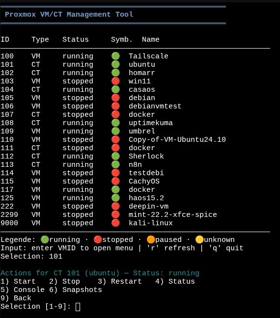

<!-- markdownlint-disable MD033 MD041 -->
<div align="center">


### Single-file Bash tool for Proxmox VM &amp; container management

<br/>

[](https://github.com/TimInTech/proxmox-manager/actions)
[](https://github.com/TimInTech/proxmox-manager/actions)
[](LICENSE)
[](https://www.gnu.org/software/bash/)
[](https://www.proxmox.com/)
[](https://github.com/TimInTech/proxmox-manager/releases)

<br/>

[](https://buymeacoffee.com/timintech)

<br/>


</div>

---

## 📸 Screenshot



---

## 🎯 What It Does

Proxmox Manager is a **single Bash script** that wraps Proxmox CLI tools (`qm`, `pct`) into an interactive menu or scriptable interface — no daemons, no agents, no dependencies beyond what ships with Proxmox VE.

| Feature | Details |
|---|---|
| 📋 **List VMs & CTs** | Status overview: running, stopped, paused |
| ⚡ **Start / Stop / Restart** | Confirmation prompt for destructive actions |
| 🖥️ **Console access** | LXC shell or QEMU terminal |
| 📷 **Snapshot management** | List, create, rollback, delete |
| 🔌 **SPICE support** | Enable and retrieve connection details |
| 📤 **Automation output** | JSON and plain-text modes |
| 📝 **Structured logging** | Via `LOG_FILE` environment variable |

---

## 🚀 Installation

```bash
git clone https://github.com/TimInTech/proxmox-manager.git
cd proxmox-manager
chmod +x proxmox-manager.sh
```

No build step. The core script has no required extra packages.

**Optional: install system-wide as `pman`** (requires root):

```bash
./install_dependencies.sh
```

```bash
pman             # interactive menu
pman --list      # plain-text table of all VMs/CTs
pman --json      # machine-readable JSON output
pman --version   # print version and exit
```

---

## 📋 Requirements

**System:** Proxmox VE 7.x / 8.x / 9.x · Bash ≥ 4.0 · Root privileges

**Bundled CLI tools:** `qm` · `pct` · `awk` · `sed` · `grep`

> No Python. No Docker. No external APIs.

---

## 🛠️ Usage

### Interactive mode

```bash
pman
```

Status symbols in the VM/CT table:

```
[+] running   [-] stopped   [~] paused   [?] unknown
```

Enter a VMID to open the action menu. Press `r` to refresh, `q` to quit.

### CLI options

```text
--list                  Plain-text table (no TUI)
--json                  Machine-readable JSON output
--filter <status>       Filter: running | stopped | paused
--timeout <seconds>     Stop timeout in seconds (default: 60)
--force                 Skip confirmation prompts
--no-clear              Do not clear screen
--once                  Single refresh cycle
--version               Print version and exit
-h, --help              Show usage
```

### JSON output

```json
[
  {"id":100,"type":"VM","status":"running","symbol":"[+]","name":"web-server"},
  {"id":101,"type":"CT","status":"stopped","symbol":"[-]","name":"db-container"}
]
```

### Shell completions

<details>
<summary><b>Bash</b></summary>

```bash
# System-wide
sudo cp completions/pman.bash /etc/bash_completion.d/pman

# Per user (~/.bashrc)
source /path/to/proxmox-manager/completions/pman.bash
```

</details>

<details>
<summary><b>Zsh</b></summary>

```bash
mkdir -p ~/.zsh/completions
cp completions/pman.zsh ~/.zsh/completions/_pman
echo 'fpath=(~/.zsh/completions $fpath)' >> ~/.zshrc
echo 'autoload -Uz compinit && compinit' >> ~/.zshrc
```

</details>

---

## 🔐 Security

- **Root required** — calls `qm`, `pct` and other Proxmox tools
- **No credentials stored** — relies on Proxmox host authentication
- **No outbound traffic** — fully local operation
- **CI hardening** — ShellCheck + Gitleaks on every push
- **Vulnerability reporting** — see `SECURITY.md`

---

## 🧪 CI & Testing

```bash
shellcheck proxmox-manager.sh          # lint
tests/run.sh                           # 8 tests via mock-bin/ stubs, no real Proxmox needed
```

CI runs on every push and PR via GitHub Actions.

---

## 🤝 Contributing

1. Fork and create a feature branch: `git checkout -b feat/your-change`
2. Keep Bash readable — avoid external dependencies
3. Run `shellcheck proxmox-manager.sh` before committing
4. Use conventional commits: `feat(vm): add suspend action`
5. Open a Pull Request

**Do not commit:** logs, reports, scan outputs, binaries, large test data.

---

## 🧩 Scope & Limitations

| ✅ Does | ❌ Does not |
|---|---|
| Interactive TUI + scriptable CLI | Replace the Proxmox web UI |
| VM & CT lifecycle management | Multi-host / cluster support |
| Snapshot operations | Terraform / Ansible integration |
| JSON output for automation | Run as a daemon |

---

## 📜 License

MIT — see [LICENSE](LICENSE).

---

<!-- markdownlint-disable MD033 MD036 -->
<div align="center">

*Boring Proxmox administration, automated ✨*

[🐛 Report Bug](https://github.com/TimInTech/proxmox-manager/issues) · [✨ Request Feature](https://github.com/TimInTech/proxmox-manager/issues) · [☕ Buy me a coffee](https://buymeacoffee.com/timintech)

</div>
<!-- markdownlint-enable MD033 MD036 -->
