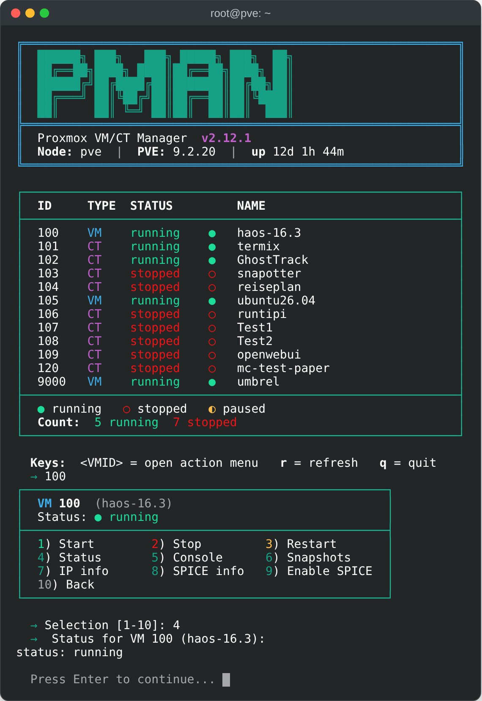
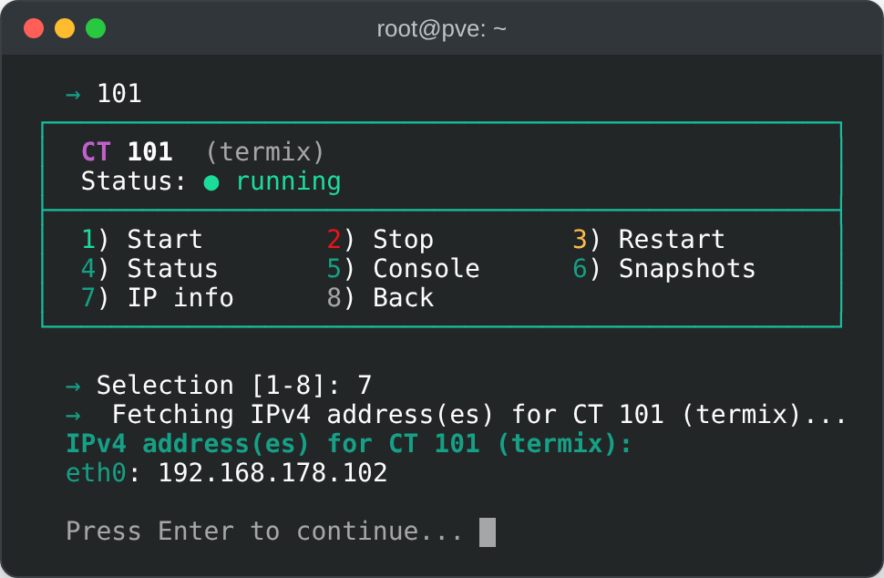
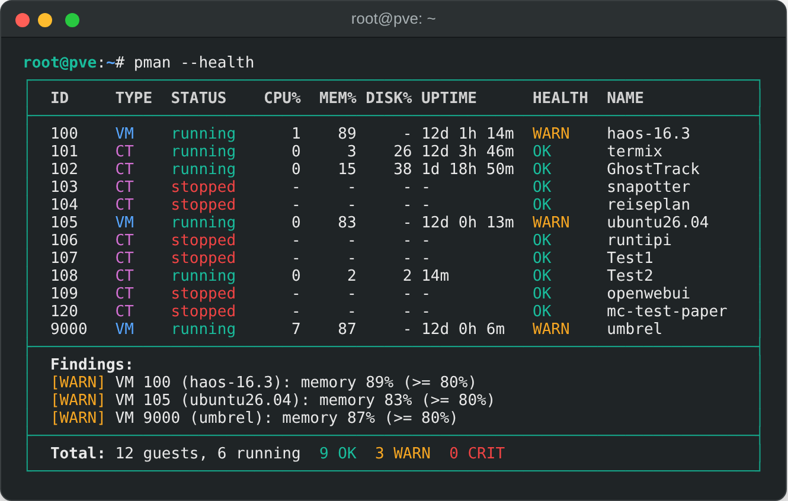
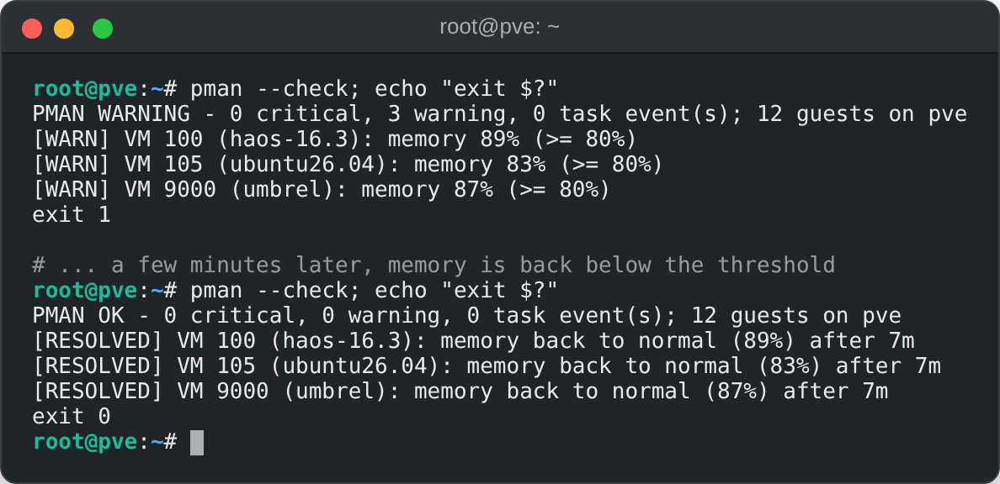
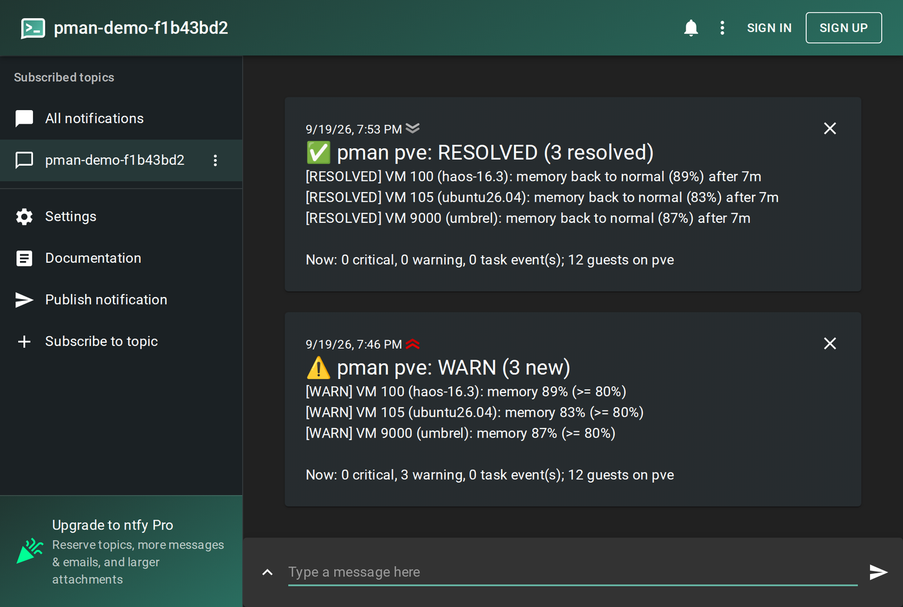
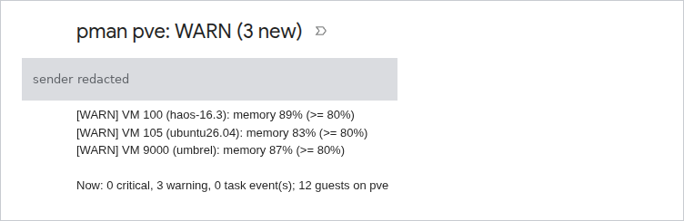
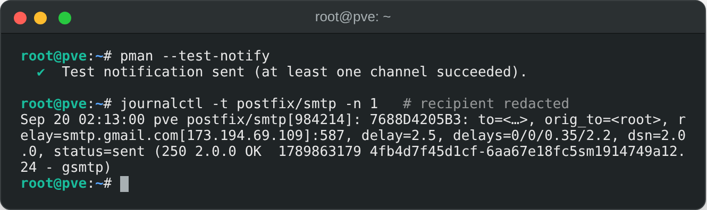

<!-- markdownlint-disable MD033 MD041 -->
<div align="center">

```text
╔══════════════════════════════════════════════════════════╗
║  ██████╗  ███╗   ███╗  █████╗  ███╗   ██╗                ║
║  ██╔══██╗ ████╗ ████║ ██╔══██╗ ████╗  ██║                ║
║  ██████╔╝ ██╔████╔██║ ███████║ ██╔██╗ ██║                ║
║  ██╔═══╝  ██║╚██╔╝██║ ██╔══██║ ██║╚██╗██║                ║
║  ██║      ██║ ╚═╝ ██║ ██║  ██║ ██║ ╚████║                ║
║  ╚═╝      ╚═╝     ╚═╝ ╚═╝  ╚═╝ ╚═╝  ╚═══╝  v2.13.0       ║
║                                                          ║
║  Proxmox VM/CT Manager · Single Bash · No Dependencies   ║
╚══════════════════════════════════════════════════════════╝
```

**Single-file Bash tool for managing Proxmox VMs and containers.**
No daemons. No agents. No dependencies beyond what ships with Proxmox VE.

**New in v2.13.0:** 🩺 health view per guest and 🔔 ntfy / e-mail alerts from a
cron check — [set up alerts in 3 steps](#-quick-start-alerts-in-3-steps).

[](https://github.com/TimInTech/proxmox-manager/actions)
[](https://github.com/TimInTech/proxmox-manager/actions)
[](LICENSE)
[](https://www.gnu.org/software/bash/)
[](https://www.proxmox.com/)


<a href="https://buymeacoffee.com/timintech" target="_blank" rel="noopener noreferrer">
  
</a>

</div>

---

## 📖 Community & Tutorials

Check out how others are using `proxmox-manager`:

- 🇵🇱 **[Proxmox Manager – Co to jest, jak działa, instalacja i
  obsługa](https://blog.askomputer.pl/proxmox-manager-timintech-co-to-jest-jak-dziala-instalacja-i-obsluga/)**
  *A detailed walkthrough and review by askomputer.pl featuring usage examples
  and screenshots (in Polish).*

## 📸 Screenshots

<div align="center">

| Main menu — VM/CT table | Action menu — status with health line |
|:---:|:---:|
|  |  |
| Live status for all VMs & containers | Start, stop, console, snapshots; `Status` adds CPU / MEM / DISK |
| **Health view — `pman --health`** | **Cron check — `pman --check`** |
|  |  |
| CPU / MEM / DISK %, uptime and level per guest | WARN → RESOLVED with Nagios exit codes |
| **ntfy push — web app** | **E-mail alert** |
|  |  |
| Same message on phone, desktop or browser | Plain-text mail via the local `sendmail` |

</div>

---

## 🎯 Features

| | Feature | Details |
|---|---|---|
| 🩺 | **Health Monitoring** | CPU / RAM / disk per guest, uptime and OK / WARN / CRIT — `pman --health`, key `h` in the TUI, `Health:` line in the status action |
| 🔔 | **Alerts** | `pman --check` for cron: thresholds, stopped `onboot` guests, unexpected stops and failed tasks; ntfy / e-mail only when something changes (opt-in) |
| 📋 | **List & Status** | All VMs and containers with live status — `[+]` running · `[-]` stopped · `[~]` paused · `[?]` unknown |
| ⚡ | **Start / Stop / Restart** | Confirmation prompt for destructive actions. Proxmox error details on failure. Configurable timeout with force-stop fallback |
| 🖥️ | **Console Access** | LXC shell via `pct enter` or QEMU terminal via `qm terminal`. Verifies running state before entering |
| 🌐 | **IP Address Lookup** | Shows current IPv4 addresses for running VMs and CTs — VM via QEMU Guest Agent, CT via `pct exec` |
| 📦 | **Snapshot Management** | List, create, rollback, delete — with name validation and snapshot preview before destructive actions |
| 🖱️ | **SPICE Integration** | Enable SPICE for VMs and retrieve `.vv` connection files. Auto-launches `virt-viewer` when installed |
| 🤖 | **Automation-Ready** | `--json` output, `--filter` by status, `--name` ERE filter, `--force` mode, structured logging via `LOG_FILE` |
| ⚙️ | **Config File** | Persistent allowlisted defaults via `/etc/pmanrc` or `~/.pmanrc` — CLI flags always win |

---

## 🔔 Quick start: alerts in 3 steps

Run as root on the Proxmox node after [installing `pman`](#-installation).

### 1 — Pick a channel in `/etc/pmanrc`

```bash
touch /etc/pmanrc && chmod 600 /etc/pmanrc
cat >>/etc/pmanrc <<'EOF'
NTFY_URL="https://ntfy.sh/pman-alerts-CHANGE-ME"   # hard-to-guess topic name
HEALTH_MAIL_TO="admin@example.com"                 # optional, needs sendmail
EOF
```

Anyone who knows a public ntfy.sh topic can read it — treat the name like a
password, or use a [protected topic](#health-monitoring--alerts) with a token.
For e-mail, most home servers need a smarthost first — see
[relaying through an external SMTP provider](#relaying-through-an-external-smtp-provider).

### 2 — Send a test message

```bash
pman --test-notify
pman --check --dry-run; echo "exit $?"   # what would be sent, nothing saved
```

Subscribe to the same topic in the [ntfy
app](https://ntfy.sh/docs/subscribe/phone/) or at `https://ntfy.sh/<your-topic>`
in the browser; the test message shows up there.

### 3 — Let cron check every 5 minutes

```bash
cat >/etc/cron.d/pman-health <<'EOF'
PATH=/usr/sbin:/usr/bin:/sbin:/bin
*/5 * * * * root /usr/local/bin/pman --check >/dev/null 2>&1
EOF
```

The first run only records a baseline. From then on, you get one message per
change — new or escalated problems, improvements and `RESOLVED`:

<p align="center">
  
</p>

Details, thresholds and limitations: [Health monitoring &
alerts](#health-monitoring--alerts).

---

## 🏗️ How It Works

A single `proxmox-manager.sh` script — no build step, no service, config
optional. Runs on-demand as root directly on the Proxmox VE node; alerts run
from cron.

```text
  User / Automation                         cron (*/5)
       │                                        │
       ▼                                        ▼
  ┌───────────────────────────────────────────────────────┐
  │  pman  (proxmox-manager.sh)                           │
  │                                                       │
  │  ┌──────────┐  ┌─────────────┐  ┌──────────────────┐  │
  │  │ --list   │  │ interactive │  │ --health         │  │
  │  │ --json   │  │    TUI      │  │ --check ─────────┼──┼──▶ ntfy / e-mail
  │  │ --filter │  │             │  │ state: /var/lib  │  │    (on change)
  │  └────┬─────┘  └──────┬──────┘  └────────┬─────────┘  │
  └───────┼───────────────┼──────────────────┼────────────┘
          │               │                  │
          ▼               ▼                  ▼
  ┌───────────────────────────────────────────────────────┐
  │  qm (VMs)  ·  pct (CTs)  ·  pvesh (usage, tasks)      │  ← Proxmox CLI
  └───────────────────────────────────────────────────────┘
          │
          ▼
  ┌───────────────────────────────────────────────────────┐
  │  Proxmox VE Host  (local)                             │
  │  QEMU Virtual Machines  ·  LXC Containers             │
  └───────────────────────────────────────────────────────┘
```

> ✅ No network calls (unless alerts are configured) · ✅ No background process ·
> ✅ Bash ≥ 4.0 · ✅ PVE 7.x / 8.x / 9.x

---

## 🚀 Installation

**Requirements:** Proxmox VE host · Bash ≥ 4.0 · Root privileges · `qm` / `pct`
/ `pvesh` and `python3` (all bundled with PVE) · optional: `sendmail` (e.g.
postfix) for e-mail alerts

### Step 1 — Clone

```bash
git clone https://github.com/TimInTech/proxmox-manager.git
cd proxmox-manager
```

### Step 2 — Run directly

```bash
chmod +x proxmox-manager.sh
./proxmox-manager.sh
```

### Step 3 — Or register as `pman` system-wide *(optional, requires root)*

```bash
./install_dependencies.sh
```

Installs an atomic, root-owned copy at `/usr/local/bin/pman` so later edits to
the checkout cannot change the privileged executable.

---

## 🛠️ Usage

| Command | Description |
|---|---|
| `pman` | Interactive TUI — VM/CT table with full action menus |
| `pman --list` | Plain-text table output — useful for logging or quick checks |
| `pman --json` | Machine-readable JSON array for automation & `jq` |
| `pman --filter running` | Filter output by status: `running` \| `stopped` \| `paused` |
| `pman --name web` | Filter by VM/CT name (ERE substring-match; combinable with `--filter`) |
| `pman --force` | Skip all confirmation prompts (for unattended scripts) |
| `pman --timeout 30` | Custom stop timeout in seconds (default: 60) |
| `pman --no-clear` | Don't clear screen in interactive mode |
| `pman --once` | Run a single interactive refresh cycle (useful for TTY recording) |
| `pman --health` | Health overview: CPU / MEM / DISK %, uptime and level per guest (`--list`, `--json` combinable) |
| `pman --check` | Health check for cron: alerts on changes, exit `0` OK · `1` WARN · `2` CRIT · `3` UNKNOWN |
| `pman --check --dry-run` | Show the check result and the message that would be sent; nothing is sent or saved |
| `pman --test-notify` | Send a test message through all configured channels |
| `pman --version` | Print version and exit |
| `pman -h, --help` | Show usage information and exit |

### Interactive mode

```text
pman
```

Displays a table of all VMs/containers. Enter a VMID to open the action menu.

```text
[+] running   [-] stopped   [~] paused   [?] unknown
```

Press `h` for the health overview · `r` to refresh · `q` to quit

### JSON output

```bash
pman --json | jq '.[] | select(.status == "running")'
```

```json
[
  {"id": 100, "type": "VM", "status": "running", "symbol": "[+]", "name": "web-server"},
  {"id": 101, "type": "CT", "status": "stopped", "symbol": "[-]", "name": "db-container"}
]
```

### SPICE remote desktop

The SPICE integration generates a `.vv` connection file for any VM. If
[`virt-viewer`](https://virt-manager.org/) is installed, it is launched
automatically:

```bash
# Install virt-viewer (Debian / Proxmox host)
apt install virt-viewer
```

When `virt-viewer` is **not** installed, the path to the generated `.vv` file is
printed together with the install hint. The SPICE bind address defaults to
`127.0.0.1` and can be overridden via `PROXMOX_MANAGER_SPICE_ADDR` (env var or
`~/.pmanrc`).

### Health monitoring & alerts

`pman --health` shows every guest on the **local node** (templates skipped) with
CPU, memory and disk usage, uptime and a health level; `--list` prints plain
text, `--json` machine-readable data (`null` where a value is not available).
The same data backs the `h` key in the TUI and the `Health:` line of the status
action.

<p align="center">
  
</p>

`pman --check` is meant for cron. It evaluates:

| Check | Level | Notes |
|---|---|---|
| CPU | WARN / CRIT | Must stay above the threshold for `HEALTH_CPU_RUNS` runs in a row |
| Memory, disk | WARN / CRIT | Immediately. VM disk usage needs the QEMU guest agent, otherwise n/a |
| *(guest stops)* | — | CPU / memory / disk alerts of a stopped guest are resolved |
| Stopped with `onboot=1` | CRIT | Configured to start at boot but not running (WARN if stopped by a task) |
| Stopped unexpectedly | WARN | Was running at the last check; its latest task is no stop/shutdown/suspend/migrate/destroy/backup |
| Failed task | WARN / CRIT | Any node task that ended not `OK` since the last run (`WARNINGS` → WARN) |

Thresholds (percent; `0` disables that level):

| Key | Default | Key | Default |
|---|---|---|---|
| `HEALTH_CPU_WARN` | 85 | `HEALTH_CPU_CRIT` | 95 |
| `HEALTH_MEM_WARN` | 90 | `HEALTH_MEM_CRIT` | 95 |
| `HEALTH_DISK_WARN` | 85 | `HEALTH_DISK_CRIT` | 95 |
| `HEALTH_CPU_RUNS` | 3 | `HEALTH_IGNORE_IDS` | *(empty)* e.g. `105,210` |

A notification is sent only when something changes: new or escalated problems,
improvements and `RESOLVED` (with duration). All changes of one run go into one
message. The first run only records a baseline, so old failed tasks are not
reported. State is kept in `HEALTH_STATE_DIR` (default `/var/lib/pman`, mode
`0700`); if every channel fails, the unsent changes stay pending and are sent by
the next run. Exit codes: `0` OK · `1` WARN · `2` CRIT · `3` UNKNOWN (usage,
config, lock or `pvesh` error) — the output is a Nagios-style summary line plus
one line per problem.

<p align="center">
  
</p>

**ntfy** — push to phone/desktop via [ntfy](https://ntfy.sh) (public or
self-hosted):

```bash
# /etc/pmanrc
NTFY_URL="https://ntfy.sh/pman-alerts-CHANGE-ME"   # use a hard-to-guess topic
NTFY_TOKEN_FILE="/etc/pman/ntfy.token"             # optional, for protected topics

# store the token in a private file (never inline in pmanrc)
install -d -m 700 /etc/pman
install -m 600 /dev/null /etc/pman/ntfy.token && nano /etc/pman/ntfy.token
```

The token file and its directory must not be writable by others; a token
requires an `https://` URL (`http://` plus a token is a configuration error).
**E-mail** uses the local `sendmail` (postfix, which PVE installs for its own
notifications, works out of the box when it can relay):

```bash
# /etc/pmanrc
HEALTH_MAIL_TO="admin@example.com"       # comma separated, no spaces
HEALTH_MAIL_FROM="pman@pve.example.com"  # optional
```

Subject and body match the ntfy message (plain text, `Auto-Submitted:
auto-generated`):

<p align="center">
  
</p>

#### Relaying through an external SMTP provider

Most home servers cannot deliver mail themselves: the provider blocks port 25
or the receiving side rejects a dynamic IP. Postfix then needs a smarthost. The
example below uses Gmail submission; any provider works the same way, only host
and port change.

**1 — Authentication.** Providers with two-factor authentication do not accept
the account password over SMTP. Create an *app password* instead (Google:
Account → Security → App passwords) and write it to a private file — enter it
yourself, so it never ends up in a shell history or a script:

```bash
apt install libsasl2-modules                      # SASL client, not installed by default
umask 077
read -rsp "app password: " P; echo
printf '[smtp.gmail.com]:587 you@example.com:%s\n' "$P" >/etc/postfix/sasl_passwd
unset P
postmap /etc/postfix/sasl_passwd
chmod 600 /etc/postfix/sasl_passwd /etc/postfix/sasl_passwd.db
```

App passwords are shown in groups of four — enter them **without the spaces**.

**2 — Postfix.** `sender_canonical` rewrites the envelope sender, because
providers only accept mail from the authenticated account:

```bash
postconf -e "relayhost = [smtp.gmail.com]:587" \
  "smtp_sasl_auth_enable = yes" \
  "smtp_sasl_password_maps = hash:/etc/postfix/sasl_passwd" \
  "smtp_sasl_security_options = noanonymous" \
  "smtp_sasl_tls_security_options = noanonymous" \
  "smtp_tls_security_level = encrypt" \
  "smtp_tls_CAfile = /etc/ssl/certs/ca-certificates.crt" \
  "sender_canonical_classes = envelope_sender" \
  "sender_canonical_maps = regexp:/etc/postfix/sender_canonical" \
  "inet_protocols = ipv4"
echo '/.+/  you@example.com' >/etc/postfix/sender_canonical
echo 'root: you@example.com' >>/etc/aliases && newaliases
systemctl restart postfix
```

`inet_protocols = ipv4` matters on hosts without a working IPv6 route:
otherwise every delivery first fails with `Network is unreachable` and the mail
sits in the queue. The `root` alias makes sure Proxmox's own notifications
reach the same mailbox.

**3 — Verify.** Send a test message and read the log; Debian 13 has no
`/var/log/mail.log`, postfix logs to the journal:

```bash
pman --test-notify
journalctl -t postfix/smtp -n 5 --no-pager   # look for status=sent
mailq                                        # should be empty
```

<p align="center">
  
</p>

Common failures: `535 5.7.8` or `534 5.7.9 Application-specific password
required` means the password is not an app password; `status=deferred` with
`Network is unreachable` is the IPv6 case above. Gmail always replaces the
`From` header with the authenticated account, so identify alerts by their
subject, or send them to a plus address such as `you+pman@example.com` and
filter on the recipient.

Test the channels, then add the cron job (set `PATH`, cron's default lacks
`/usr/sbin`):

```bash
pman --test-notify
pman --check --dry-run; echo "exit $?"
```

```text
# /etc/cron.d/pman-health
PATH=/usr/sbin:/usr/bin:/sbin:/bin
*/5 * * * * root /usr/local/bin/pman --check >/dev/null 2>&1
```

Limitations: a shutdown from **inside** a guest has no Proxmox task and is
reported as "stopped unexpectedly"; in a cluster, run the cron job on **every
node** (each checks only its own guests); failed tasks are read from the last
200 node tasks.

### Configuration

`proxmox-manager` checks the following files at startup (in this order):

| File | Scope |
|---|---|
| `/etc/pmanrc` | System-wide (all users) |
| `~/.pmanrc` | Per-user (overrides system-wide) |

CLI flags are applied last and always win over config file values.

```bash
# ~/.pmanrc — example
STOP_TIMEOUT=120                          # stop timeout in seconds (default: 60)
LOG_FILE="/var/log/proxmox-manager.log"   # structured log file (empty = disabled)
PROXMOX_MANAGER_SPICE_ADDR="spice.example.invalid" # SPICE bind address
HEALTH_MEM_WARN=80                        # health thresholds, see "Health monitoring & alerts"
NTFY_URL="https://ntfy.sh/pman-alerts-CHANGE-ME"
```

Configuration files are parsed as data, not executed as shell code. Accepted
keys: `STOP_TIMEOUT`, `LOG_FILE`, `PROXMOX_MANAGER_SPICE_ADDR`,
`HEALTH_CPU_WARN`, `HEALTH_CPU_CRIT`, `HEALTH_MEM_WARN`, `HEALTH_MEM_CRIT`,
`HEALTH_DISK_WARN`, `HEALTH_DISK_CRIT`, `HEALTH_CPU_RUNS`, `HEALTH_IGNORE_IDS`,
`HEALTH_STATE_DIR`, `NTFY_URL`, `NTFY_TOKEN_FILE`, `HEALTH_MAIL_TO` and
`HEALTH_MAIL_FROM`; anything else is ignored with a warning. Health settings are
validated only by `--health`, `--check` and `--test-notify`, so a typo never
blocks the TUI. Because the file may name alert targets, keep it private: `chmod
600 /etc/pmanrc`. When enabled, `LOG_FILE` must be an absolute, non-symlinked
regular file owned by the current user with mode `0600`; its parent directory
must also be owner-controlled and not group/world-writable.

### Shell Completions

```bash
# Bash (system-wide)
sudo cp completions/pman.bash /etc/bash_completion.d/pman

# Zsh
mkdir -p ~/.zsh/completions
cp completions/pman.zsh ~/.zsh/completions/_pman
```

---

## 🔐 Security

- **Root required:** `qm` and `pct` need elevated privileges — there's no
  workaround.
- **No credentials stored:** Relies entirely on Proxmox host authentication.
- **No outbound traffic unless notifications are configured:** alerts via ntfy /
  e-mail are opt-in; the ntfy token is read from a `0600` file, passed to `curl`
  via stdin and never sent over plain http.
- **CI hardening:** ShellCheck on every push · Gitleaks scan for accidental
  secrets.

---

## 📋 Changelog

### 🆕 [v2.13.0](CHANGELOG.md) — 2026-09-19

> Health view (`--health`, key `h`) · `--check` for cron with ntfy / e-mail
> alerts on changes · exit codes 0/1/2/3 · `--test-notify`

### [v2.12.1](CHANGELOG.md) — 2026-09-19

> Action and snapshot menus draw a closed frame · README screenshots regenerated

### [v2.12.0](CHANGELOG.md) — 2026-09-19

| Issue | Change |
|---|---|
| [#33](https://github.com/TimInTech/proxmox-manager/issues/33) | TUI frames aligned by visible width; long guest names grow the NAME column (truncated at terminal width); correct PVE version and compact uptime in the header |
| [#31](https://github.com/TimInTech/proxmox-manager/pull/31) | Security hardening: config files parsed as allowlisted data (no `source`), private log files, atomic root-owned `pman` install, SHA-pinned CI |
| [#30](https://github.com/TimInTech/proxmox-manager/pull/30) | Snapshot names validated against Proxmox rules; SPICE `.vv` files use the real bind address/port |
| [#28](https://github.com/TimInTech/proxmox-manager/issues/28) | New **IP info** menu item to show current IPv4 addresses for running VMs and CTs |

### [v2.11.1](CHANGELOG.md) — 2026-05-04

| Issue | Change |
|---|---|
| [#21](https://github.com/TimInTech/proxmox-manager/issues/21) | Full Proxmox stderr written to `LOG_FILE`; only first line shown on stdout |
| [#22](https://github.com/TimInTech/proxmox-manager/issues/22) | Config file support: `/etc/pmanrc` and `~/.pmanrc` loaded before CLI flags |
| [#23](https://github.com/TimInTech/proxmox-manager/issues/23) | Numbered snapshot selection for rollback and delete (free-text fallback) |
| [#24](https://github.com/TimInTech/proxmox-manager/issues/24) | `validate_menu_choice()` helper — unified error format for all menu inputs |
| [#25](https://github.com/TimInTech/proxmox-manager/issues/25) | `--name PATTERN` flag — ERE substring filter on VM/CT name, combinable with `--filter` |
| [#26](https://github.com/TimInTech/proxmox-manager/issues/26) | `virt-viewer` auto-launched from SPICE info; fallback hint when not installed |
| [#28](https://github.com/TimInTech/proxmox-manager/issues/28) | New **IP info** menu item to show current IPv4 addresses for running VMs and CTs |

### [v2.9.0](CHANGELOG.md) — 2026-04-09

> `--filter STATUS` · `--timeout SECS` with force-stop fallback · `--force` mode
> · 29 unit tests · Bash & Zsh shell completions

**→ [View full CHANGELOG](CHANGELOG.md)**

---

## 🧪 Testing

```bash
# Lint
shellcheck proxmox-manager.sh

# Unit tests (no real Proxmox needed — uses mock stubs)
tests/run.sh
```

131 tests covering `validate_vmid`, `validate_snapshot_name`, `ip_info`,
`--filter`, CLI flags, config parsing, the health view, the `--check` engine and
notifications (mocked `pvesh`, `curl`, `sendmail`; no network, no root).

---

## 🤝 Contributing

Contributions welcome — keep it simple, keep it Bash.

1. Fork & create a feature branch: `git checkout -b feat/your-change`
2. Keep external dependencies at zero. Run `shellcheck` locally.
3. Commit with conventional format: `feat(vm): add suspend action`
4. Open a Pull Request.

**Do not commit:** generated files, scan outputs, binary files, or large test
data.

---

## 📜 License

MIT License — see [LICENSE](LICENSE) for full text.

---

<!-- markdownlint-disable MD033 -->
<div align="center">

### Boring Proxmox administration, automated ✨

[🐛 Report Bug](https://github.com/TimInTech/proxmox-manager/issues) ·
[✨ Request Feature](https://github.com/TimInTech/proxmox-manager/issues) ·
[📋 Changelog](CHANGELOG.md)

</div>
